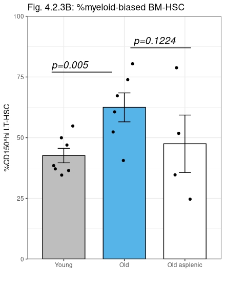

```{r setup, include=FALSE}
knitr::opts_chunk$set(echo = TRUE)
```

```{r klippy, echo=FALSE, include=TRUE}
klippy::klippy(
  position = c('top', 'right'),
  color = "auto",
  tooltip_message = "Copy code",
  tooltip_success = "Copied!"
)
```


<center>

</center>


<br><br>

## Understanding your data

Example: Comparing CD150hi (myeloid-biased) HSC between young and old animals

When thinking about your data, identify the following:

1. What are you comparing **(independent variables)**?
 + *Young and old animals (ie. Category = Age)*

2. What is your measurement **(dependent variables)**?
  + *The percentage of CD150^hi^ HSC (Category = HSC)*


## Import data from a Prism file
List all the data tables in the Prism file.

```{r}
library(pzfx)
pzfx_tables("../data/young vs old graphs JTmod.pzfx")
```

Now we can select which data table to import:
```{r}
Fig423b <- read_pzfx("../data/young vs old graphs JTmod.pzfx", "Figure 4.2.3B")
head(Fig423b, N = 6)
```

Oh no! The data is in a format which RStudio can't read!

We need to arrange this dataset so that each column lists a variable (Age, HSC).

Fortunately, we can call on the "pivot_longer" function to convert data into "Tall format":
```{r, message = FALSE}
library(tidyverse)
Fig423b.tall <- Fig423b %>% select(Young, Old, "Old asplenic") %>%
  pivot_longer(., cols = c(Young,Old,"Old asplenic"), names_to = "Age", values_to = "HSC") ## Concatenate columns (Young, Old, Old Asplenic) into one column (age)
head(Fig423b.tall, N = 21)
```

Now all the observations (values for percent HSC) are listed in one column.

## Run descriptive statistics
We will now find the average %HSC for all treatment groups (Average = mean(HSC)).
```{r}
Fig423b.tall %>% 
  select(Age, HSC) %>%
  filter(Age == "Young"|
           Age == "Old"|
           Age == "Old asplenic") %>% 
  na.omit() %>% # Omit values with 'NA'
  group_by(Age) %>% 
  summarise(Average = mean(HSC))
```

## To perform an unpaired two-sample t-test, create dataframe pairs for comparison
```{r}
Fig423b.youngvsold <- Fig423b.tall %>% 
  select(Age, HSC) %>%
  filter(Age == "Young"|
           Age == "Old") %>% 
  na.omit()
View(Fig423b.youngvsold)
```
```{r}
Fig423b.oldvsoldasplenic <- Fig423b.tall %>% 
  select(Age, HSC) %>%
  filter(Age == "Old"|
           Age == "Old asplenic") %>% 
  na.omit()
View(Fig423b.oldvsoldasplenic)
```


## Background statistics information
Unpaired two-samples t-test can be used only under certain conditions:

1. When the two groups of samples (A and B), being compared, are normally distributed. This can be checked using Shapiro-Wilk test.
2. When the variances of the two groups are equal. This can be checked using F-test.

http://www.sthda.com/english/wiki/unpaired-two-samples-t-test-in-r

## Shapiro-Wilk normality test
Null hypothesis: the data are normally distributed

Alternative hypothesis: the data are not normally distributed

To test %HSC in young animals:
```{r}
with(Fig423b.tall, shapiro.test(HSC[Age == "Young"]))
```
To test %HSC in old animals:
```{r}
with(Fig423b.tall, shapiro.test(HSC[Age == "Old"]))
```
To test %HSC in Old asplenic animals:
```{r}
with(Fig423b.tall, shapiro.test(HSC[Age == "Old asplenic"]))
```
From the outputs, the p-values are greater than the significance level 0.05.

This implies the distribution of the data are not significantly different from the normal distribution.

In other words, we can assume the normality.

<br>

## F-test to test for homogeneity in variances
```{r}
var.test(HSC ~ Age, data = Fig423b.youngvsold)
var.test(HSC ~ Age, data = Fig423b.oldvsoldasplenic)
```
The p-values of F-test are greater than the significance level 0.05

This implies there is no significant difference between the variances of the two sets of data.

Therefore, we can use the classic t-test witch assume equality of the two variances.

Note that:

1. If the variance of the two groups are equivalent (homoscedasticity; var.equal = TRUE), the student t-test value can be used
2. If the variance of the two groups are different (heteroscedasticity; var.equal = FALSE), it’s possible to use the Welch t test, an adaptation of Student t-test


## Students t-test
By default, R computes the Welch t-test with the default arguments:

* t.test(data = Fig423b.youngvsold, HSC ~ Age) ## p-value = 0.01904, reject null hypothesis (that there is no difference between groups)
* t.test(data = Fig423b.oldvsoldasplenic, HSC ~ Age) ## p-value = 0.3136, cannot reject null hypothesis

If homoscedasticity can be assumed, then:

* t.test(data = Fig423b.youngvsold, HSC ~ Age, var.equal = TRUE) ## p-value = 0.009666
* t.test(data = Fig423b.oldvsoldasplenic, HSC ~ Age, var.equal = TRUE) ## p-value = 0.2449

## Applying a one-tailed t-test
The following hypotheses are first defined:

1. H0:mA≤mB, ie. Null hypothesis: HSC(old) is less than or equal to HSC(young[control])
2. Ha:mA>mB (greater), ie. Alternative hypothesis: HSC(old) is greater than HSC(young)
```{r}
t.test(data = Fig423b.youngvsold, HSC ~ Age, var.equal = TRUE, alternative = "greater")
## If the observed difference went in the direction predicted by the experimental hypothesis,
## the one-tailed P value is half the two-tailed P value (with most, but not quite all, statistical tests).
```
```{r}
t.test(data = Fig423b.oldvsoldasplenic, HSC ~ Age, var.equal = TRUE, alternative = "greater")
```
Here, we can see that there is a significant difference between young and old animals (p=0.005), but there is no significant difference between old and old-asplenic animals (p=0.1224).

## Compute summary statistics
Before we make a bar graph with pvalues, we need to compute summary statistics for the variable "HSC" organised into groups by the variable "Age".

https://www.datanovia.com/en/lessons/ggplot-error-bars/

First, we will compute the standard error:

https://www.r-graph-gallery.com/4-barplot-with-error-bar.html
```{r}
Fig423b.tallna <- Fig423b.tall %>% na.omit() # Omit values in the dataframe with NA
Fig423b.tallna.summary <- Fig423b.tallna %>%
  group_by(Age) %>%
  summarise(
    n=n(),
    sd = sd(HSC, na.rm = TRUE), ## Handling missing data: If there are NA’s in the data, you need to pass the flag na.rm=TRUE
    HSC = mean(HSC)
  ) %>%
  mutate( se=sd/sqrt(n))
Fig423b.tallna.summary
```


## Create bar plot of means + individual jitter points + standard errors + annotations
https://www.datanovia.com/en/lessons/ggplot-error-bars/
```{r}
Fig423b.tallna %>%
  ggplot(aes(Age, HSC)) +
  geom_col(data = Fig423b.tallna.summary, fill = c("#56B4E9", "white", "gray"), color = "black", width = 0.7) +
  scale_x_discrete(limits = c("Young", "Old", "Old asplenic")) +
  scale_y_continuous(expand = c(0, 0), limits = c(0, 100)) +
  geom_jitter(position = position_jitter(0.2), color = "black") + 
  geom_errorbar(aes(ymin = HSC-se, ymax = HSC+se), 
                 data = Fig423b.tallna.summary, width = 0.2) +
  theme_bw() +
  theme(legend.position="none") + ## This can be set to top/bottom/none
  labs(x = "",
       y = "%CD150^hi LT-HSC",
       title = "Fig. 4.2.3B: %myeloid-biased BM-HSC") +
  annotate("text", x = c(1.1,2.5), y = c(80,90), 
           label = c("p=0.005", "p=0.1224") , color="black", 
           size=5 , angle=0, fontface="italic") +
  annotate(geom = "segment", x = c(0.8,2.1), xend = c(1.8,3.1), y = c(77,87), yend = c(77,87), colour = "#060606") 
```


**Congratulations!**

We have created an annotated bar graph showing statistics (standard error bars, p-value for one-tailed students t-tests)

* We have 1 categorical variable (Age) and one numeric variable (%HSC)
* The categorical (independent) variable is plotted on the x-axis (x=Age)
* The numerical (dependent) variable is plotted on the y-axis (HSC)

***


