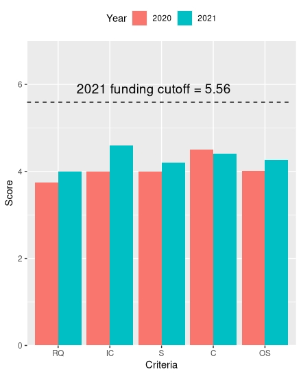

```{r setup, include=FALSE}
knitr::opts_chunk$set(echo = TRUE)
```

```{r klippy, echo=FALSE, include=TRUE}
klippy::klippy(
  position = c('top', 'right'),
  color = "auto",
  tooltip_message = "Copy code",
  tooltip_success = "Copied!"
)
```

<center>

</center>

<br>

## Understanding your data

Example: NHMRC scores over the last 2 years

When thinking about your data, identify the following:

1. What are you comparing **(independent variables)**?

- Data from 2020, 2021 (ie. Category = Years)
- Scoring criteria such as Research Quality [RQ], Significance [S] (Category = Criteria)

2. What is your measurement **(dependent variables)**?
  * Score [value of 1-6] (Numerical values)
  
## Create a .csv file
  
For this dataset, create a .csv file with 3 columns listing values for each of:

1. Year
2. Criteria
3. Score

## Import data to RStudio

Now let's load the data!

```{r, message = FALSE}
library(tidyverse)
```

Import the .csv file into a dataframe and call it "nhmrc":
```{r}
library(readr)
nhmrc <- read_csv("../data/NHMRC_scoring_history2.csv", 
                  col_types = cols(Score = col_number()))
head(nhmrc, n = 12L)
```

## Make a grouped bar graph

The data can now be plotted in a grouped bar graph using the following code:

```{r}
nhmrc  %>% 
  filter(Year %in% c("2020", "2021")) %>%
  filter(Criteria %in% c("RQ", "IC", "S", "C", "OS")) %>%
  ggplot(aes(x=Criteria, y=Score, fill=Year)) +
  scale_x_discrete(limits = c("RQ", "IC", "S", "C", "OS")) +
  geom_bar(stat="identity", position="dodge") +
  scale_y_continuous(expand = c(0, 0), limits = c(0, 7)) +
  theme(legend.position="top") +
  annotate(geom = "segment", x = 0.4, xend = 5.5, y = 5.59, yend = 5.59, colour = "#060606", linetype=2) +
  annotate("text", x = c(2.85), y = c(5.9), 
           label = "2021 funding cutoff = 5.56" , color="black", 
           size=5, angle=0) +
  ylab("Score")
```

**Congratulations!**
We have created a grouped (dodged) bar graph.

* We have 2 categorical variables (Year, Criteria) and one numeric variable (Score)
* One categorical variable has been plotted on the x-axis (x=Criteria)
* The other categorical variable has been displayed using the "fill" argument (fill=Year)

***


