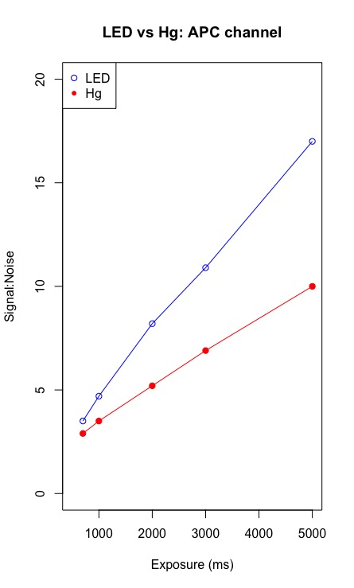

```{r setup, include=FALSE}
knitr::opts_chunk$set(echo = TRUE)
```

```{r klippy, echo=FALSE, include=TRUE}
klippy::klippy(
  position = c('top', 'right'),
  color = "auto",
  tooltip_message = "Copy code",
  tooltip_success = "Copied!"
)
```

<center>

</center>

<br>

## Create XY data values

```{r}
X <- c(700, 1000, 2000, 3000, 5000)
Y <- c(3.5, 4.7, 8.2, 10.9, NA)
```

<br>

Plot values:
```{r}
plot(X, Y, 
     xlim=c(500,5000) , ylim=c(0,20),    # axis range
     ylab = "Signal:Noise",    # y-axis label
     xlab = "Exposure (ms)",    # x-axis label
     main = "LED vs Hg: APC channel",    # main title
     type = "o",    # type of line
     pch = 1,    # shape of data point
     lwd = 1,    # line width
     col = "blue")
```

Add an extra dataset:
```{r}
mX <- c(700, 1000, 2000, 3000, 5000)
mY <- c(2.9, 3.5, 5.2, 6.9, 10.0)
```

Add extra datapoints to XY plot:
```{r}
plot(X, Y, 
     xlim=c(500,5000) , ylim=c(0,20),    # axis range
     ylab = "Signal:Noise",    # y-axis label
     xlab = "Exposure (ms)",    # x-axis label
     main = "LED vs Hg: APC channel",    # main title
     type = "o",    # type of line
     pch = 1,    # shape of data point
     lwd = 1,    # line width
     col = "blue")

points(mX, mY,
       type = "o",    # type of line
       col = "red",
       pch = 20,
       cex = 1.5)    # size of data point

legend("topleft",
       legend = c("LED", "Hg"),
       col = c("blue", "red"),
       pch = c(1, 20))
```

<br>

**Congratulations!**

We have created an XY plot!

***


