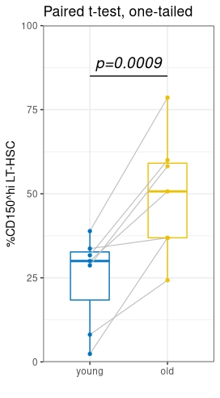

```{r setup, include=FALSE}
knitr::opts_chunk$set(echo = TRUE)
```

```{r klippy, echo=FALSE, include=TRUE}
klippy::klippy(
  position = c('top', 'right'),
  color = "auto",
  tooltip_message = "Copy code",
  tooltip_success = "Copied!"
)
```

<center>

</center>

<br>

## Understanding the data

Example: Compare the percentage of myeloid-biased HSC between young and old animals.

<br>

When thinking about your data, identify the following:

1. What are you comparing **(independent variables)**?

- Young vs old animals (ie. Category = Group)

2. What is your measurement **(dependent variables)**?
  * Percent myeloid-biased HSC (Numerical value)

<br>
  
## Create a datafile directly in RStudio

http://www.sthda.com/english/articles/24-ggpubr-publication-ready-plots/76-add-p-values-and-significance-levels-to-ggplots/#compare-two-paired-samples

http://www.sthda.com/english/wiki/paired-samples-t-test-in-r


Data can be entered into two numeric vectors:
```{r}
young <-c(30, 38.9, 31.7, 2.38, 8.11, 33.7, 28.7)
old <-c(50.7, 78.6, 60, 36.9, 24.3, 36.9, 58.2)
```

<br>

Create a data frame called "expt":
```{r}
expt <- data.frame( 
  group = rep(c("young", "old"), each = 7),
  HSC = c(young,  old)
)

print(expt)
```

<br>

Now is a good time to load the relevant packages:
```{r, message = FALSE}
library(tidyverse)
library(ggpubr)
```

## Statistics
Compute one-tailed paired students t-test:
```{r}
stats <- t.test(HSC ~ group, data = expt, paired = TRUE, var.equal = TRUE, alternative = "greater")
stats
```

## Create paired box plot
Plot %HSC by group (young vs old) and color by group:
```{r}
ggpaired(expt, x = "group", y = "HSC",
         color = "group", line.color = "gray", line.size = 0.4,
         palette = "jco") +
         scale_y_continuous(expand = c(0, 0), limits = c(0, 100)) +
         theme_bw() +
         theme(legend.position="none") +
         labs(x = "",
               y = "%CD150^hi LT-HSC",
               title = "Paired t-test, one-tailed") +
          annotate("text", x = c(1.5), y = c(89), 
                   label = c("p=0.0009") , color="black", 
                   size=5 , angle=0, fontface="italic") +
          annotate(geom = "segment", x = c(1), xend = c(2), y = c(85), yend = c(85), colour = "#060606") 
```


**Congratulations!**
We have performed a paired t-test and plotted the results.


***


